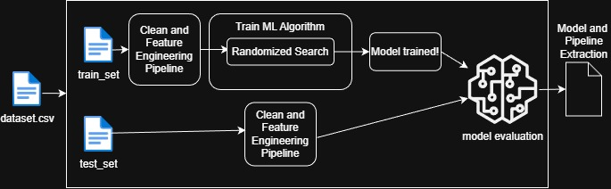
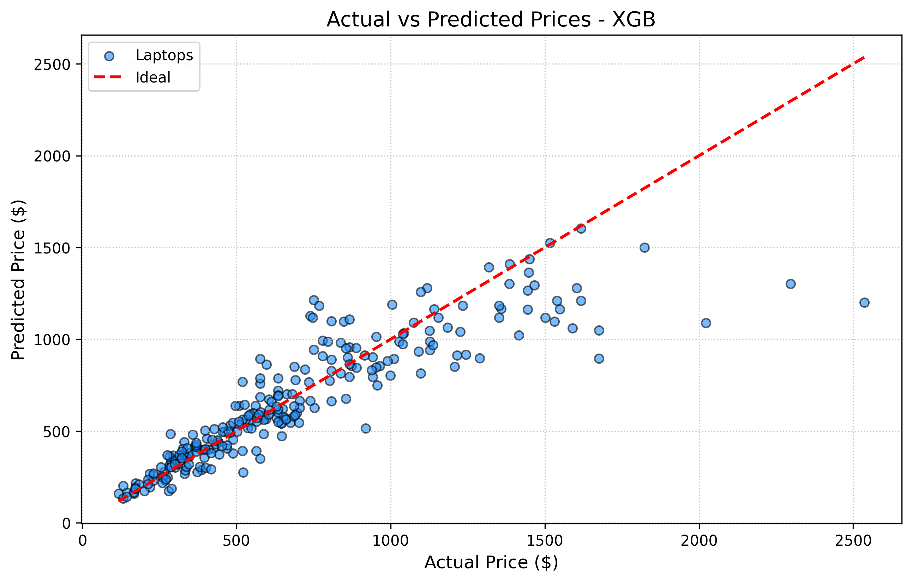

# Laptop Price Prediction


This project implements a Machine Learning pipeline to predict laptop prices based on technical specifications. It features a robust data preprocessing workflow and a fine-tuned Random Forest model.

## Dataset
The model was trained using the [Laptop Price Dataset](https://www.kaggle.com/datasets/adityamishraml/laptops/data) from Kaggle. The data includes features like CPU speed, RAM, Storage (SSD/HDD), Screen Resolution, and GPU tiers.


## Project Folder Structure

This project folder structure is organized as follows

```
├── dataset/                # Raw dataset and Synthetic dataset
├── figures/                # Relevant figures
├── models/                 # Saved model & pipeline
|   ├── model.pkl           # Model and pipeline stored
|   ├── results/            # Training reports and performance logs
|   └── evaluate.py         # Script that evaluates the model on an independent dataset
├── scripts/                # Source code for training and processing
│   ├── model_train.py      # Main execution script
|   ├── functions.py        # Custom Functions for this project
|   ├── classes.py          # Custom Scikit-Learn transformers
|   ├── ml_algorithm.py     # Contains the Routines that implements RandomFortestRegression
│   └── pipelines.py        # Pipelines
├── README.md               # This readme
├── .gitignore              # gitignore file
└── Project.ipynb           # Jupyter notebook containing the Exploratory Data Analysis
```

## Project Architecture
### Overview

The overall architecture of this project follows the diagram.



Among the `.py` files, there are some main categories:
- Auxiliary files: `functions.py, classes.py, model_train.py, pipelines.py`
- Main training file: `main_training.py`
- Model application file: `evaluate.py`

There are two main stages: the `model training and testing` and the `model application`. 
-  On the first stage, the model receives a `dataset` on csv format, then proceeds to split the dataset to a `train_set` and a `test_set`. The `train_set` goes through a pipeline that implements cleaning and feature engineering procedures. It then proceeds to train a RandomForest model using the `RandomizedSearchCV` method, that searches for the best parameters for the model. Finally, the `test_set` is tested, proceeding with a model and pipeline saving on a `.pkl` format, and a `model_report.txt`.

- The second stage happens after the model training and testing. It is foused on a production envinronment, where the `.pkl` file is read, together with the auxiliary files that prepares a `new_dataset`, completely independent from the first, to go to a Price prediction.

### Detailed view over the files.

We start with the Auxiliary files:

The `functions.py` file contains some usefull functions used during the training
```
functions.py
├── def import_data()        # Reads the .csv file
├── def split_data()         # Implements the train_test_split from scikit-learn
├── def cut_price_outliers() # Remove the price outliers
├── def price_to_usd()       # Obtain the currency rate from a public API and transform the price to USD
├── def clean_target()       # Apply the price_to_usd() without overloading the API
├── def target_extraction()  # Extracts the 'Price' column from the dataset
├── def log_target()         # Extract the target and Apply the log transformation to a column
├── def comparison()         # Calculate the root mean square error and the confidence interval from the test_set
├── def save_results_txt()   # Saves the results log from the test part
└── def export_model()       # Saves the model and the pipeline
```

The `classes.py` function defines some classes in order to personalize the Pipeline
```
classes.py
├── class DataCleaner()      # Cleans the data, managing the NaN and removing columns
└── class GPUTierExtractor() # Modify the `gpu_name` column in order to deal with the small number of ocurrences by classifying the names into new classes.
```

We define the pipelines on the `pipelines.py` method

```
pipelines.py
├── def get_attribs()   # Implement a pipeline to extract the numerical and categorical attributes
└── def full_pipeline() # Implement the full pipeline: cleaning, feature engineering and encoding
```

The `ml_algorithm.py` file defines the MachineLearning Algorithm and the parameters search method.

```
ml_algorithm.py
├── def train_RFR_random() # Implements the RandomForestRegressor() and search the best parameters randomly
└── def train_XGB_random() #  Implements the XGBRegressor() and search the best parameters randomly
```

The `model_train.py` file applies the necessary routines and pipelines in order to train and test the two models. At last, it evaluate which model performed best then proceeds to extract the model, the pipeline and the results log.

After the training and testing, the model is applied to a synthetic csv dataset, generated using AI to simualte a real production environment by using the `evaluate.py` method.

## Performance Results
After rigorous hyperparameter tuning and the implementation of the target-variable log transformation, the XGBoost model achieved the following results on the unseen test set:

| Metric | Value |
| :--- | :--- |
| **Root Mean Squared Error (RMSE)** | **$195.61** |
| **95% Confidence Interval** | **$141.17 to $237.91** |

### Actual vs. Predicted Analysis
The following figure illustrates the relationship between the actual market prices and the prices estimated by the model. The alignment with the "Ideal" line indicates how well the model captures the price distribution across different hardware tiers.



---

## Key Insights

### What do these metrics mean?
* **RMSE ($195.61):** On average, the model's price predictions deviate from the actual market price by approximately **$195.61**. Considering the laptop market features high variance—with prices ranging from $200 budget netbooks to $3,000+ high-end gaming rigs—this error margin demonstrates that the model captures underlying pricing patterns highly effectively.
* **Confidence Interval:** We can be **95% confident** that the true average prediction error of this model lies between **$141.17 and $237.91**. This narrow band indicates a stable and reliable model that doesn't suffer from wild, unpredictable fluctuations in its estimates.

### Model Behavior & Evolution
* **Linearity and Scaling:** By using a log transformation on the target variable, the model successfully handled the heteroscedasticity (varying error scales) typical of price data. 
* **XGBoost Advantage:** Compared to previous iterations (Random Forest), the XGBoost regressor showed a superior ability to follow the price trend for mid-to-high-range laptops (up to $1,600), significantly reducing the systematic underestimation previously observed.
* **Residual Challenges:** High-end "outlier" laptops (above $2,000) still present a challenge. This suggests that price-driving factors for luxury or specialized hardware (e.g., specific GPU models or build materials) may require further feature engineering to be fully captured.

---
